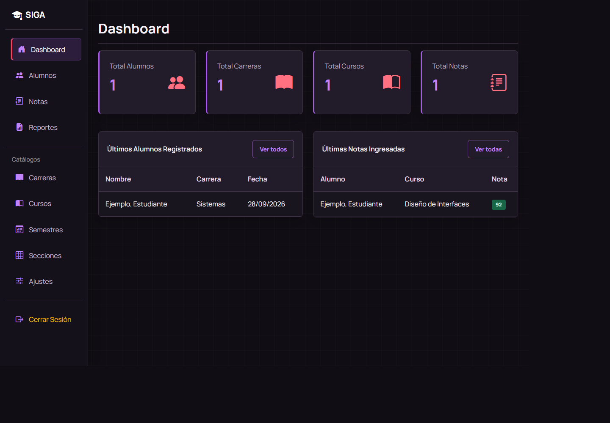
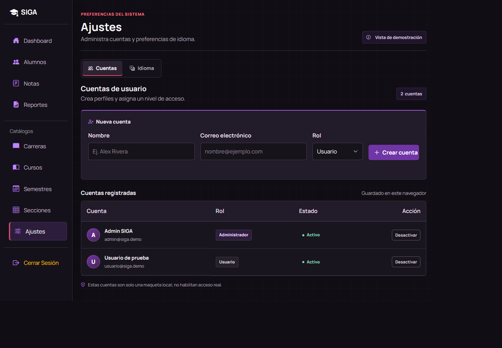
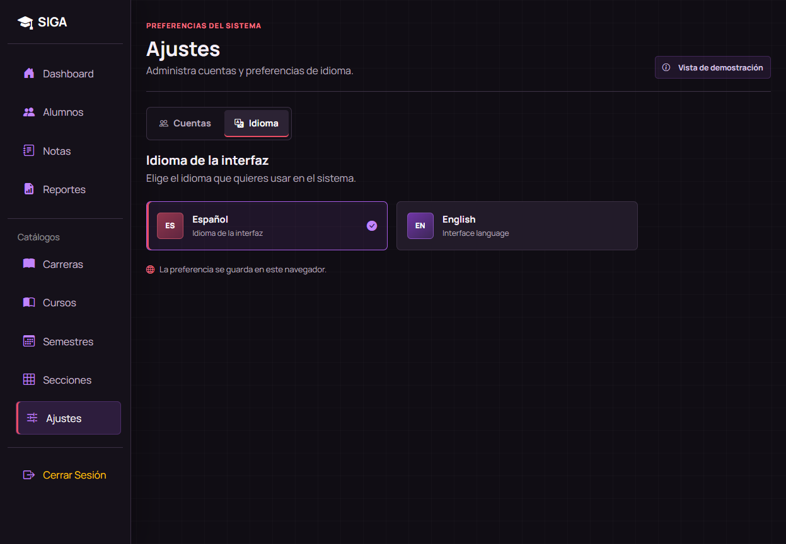
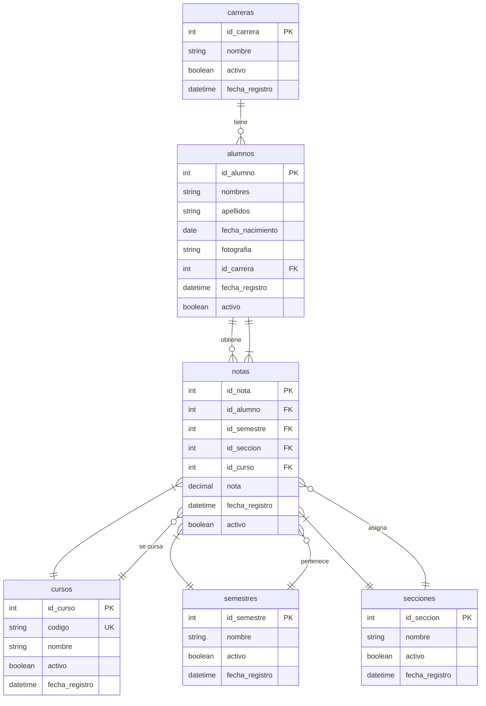

# Sistema Académico

Sistema web para gestión de alumnos, cursos y notas de una escuela de bachillerato. Permite registrar alumnos, administrar catálogos (carreras, cursos, semestres, secciones), registrar notas, consultar historial académico y generar reportes.

## Características

- **Gestión de Catálogos**: CRUD completo para carreras, cursos, semestres y secciones
- **Gestión de Alumnos**: Registro con fotografía, edición, búsqueda y desactivación
- **Gestión de Notas**: Registro de notas con validaciones, historial académico y estadísticas
- **Reportes**: Reportes de alumnos por carrera, reportes de notas con filtros y reportes individuales
- **Exportación**: Exportación de reportes a formato CSV
- **Dashboard**: Panel de control con estadísticas generales
- **Ajustes de interfaz**: Creación de perfiles de demostración con roles Usuario y Administrador
- **Idiomas**: Interfaz en español e inglés, con preferencia guardada en el navegador
- **Seguridad**: Protección CSRF, validaciones en servidor y cliente, consultas SQL parametrizadas
- **Interfaz Responsiva**: Tema oscuro morado y rojo adaptable a móvil y escritorio

## Capturas de la Aplicación

### Dashboard


### Ajustes de cuentas


### Ajustes de idioma


> Las cuentas creadas desde Ajustes son demostrativas y se guardan únicamente en el navegador; no habilitan acceso real.

## Tecnologías

- **PHP 8.1+**
- **Fat-Free Framework 3.x**
- **MySQL 8**
- **Composer**
- **HTML5, CSS3, JavaScript**
- **Bootstrap 5**

## Requisitos del Sistema

- PHP 8.1 o superior
- MySQL 8.0 o superior
- Composer
- Servidor web (Apache, Nginx o servidor PHP integrado)
- Extensiones PHP: pdo_mysql, mbstring, fileinfo

## Instalación

### 1. Instalar PHP

**Windows:**
- Descargar PHP desde https://windows.php.net/download/
- Extraer en una carpeta (ej: C:\php)
- Agregar C:\php al PATH del sistema

**Linux (Ubuntu/Debian):**
```bash
sudo apt update
sudo apt install php8.1 php8.1-mysql php8.1-mbstring php8.1-xml php8.1-curl
```

**macOS:**
```bash
brew install php@8.1
```

### 2. Instalar MySQL

**Windows:**
- Descargar MySQL Installer desde https://dev.mysql.com/downloads/installer/
- Ejecutar el instalador y seguir las instrucciones

**Linux (Ubuntu/Debian):**
```bash
sudo apt install mysql-server
sudo mysql_secure_installation
```

**macOS:**
```bash
brew install mysql
brew services start mysql
```

### 3. Instalar Composer

**Windows:**
- Descargar Composer-Setup.exe desde https://getcomposer.org/download/
- Ejecutar el instalador

**Linux/macOS:**
```bash
curl -sS https://getcomposer.org/installer | php
sudo mv composer.phar /usr/local/bin/composer
```

### 4. Clonar o Copiar el Proyecto

```bash
cd C:\Users\terra\CascadeProjects\sistema-academico
```

### 5. Instalar Dependencias

```bash
composer install
```

### 6. Configurar el Archivo .env

Copiar el archivo de ejemplo:
```bash
copy .env.example .env
```

Editar el archivo `.env` con sus credenciales de base de datos:
```env
DB_HOST=localhost
DB_PORT=3306
DB_NAME=sistema_academico
DB_USER=root
DB_PASS=tu_contraseña

APP_NAME=Sistema Académico
APP_ENV=development
APP_DEBUG=true
APP_URL=http://localhost:8000

NOTA_MINIMA_APROBACION=60
NOTA_MAXIMA=100

MAX_FILE_SIZE=2097152
ALLOWED_IMAGE_TYPES=image/jpeg,image/jpg,image/png

PAGINATION_LIMIT=20
```

### 7. Crear la Base de Datos

Iniciar sesión en MySQL:
```bash
mysql -u root -p
```

Ejecutar el script SQL:
```bash
mysql -u root -p < sql/sistema_academico.sql
```

O ejecutar manualmente desde el cliente MySQL:
```sql
source sql/sistema_academico.sql
```

### 8. Configurar Permisos de Escritura

Asegurarse de que la carpeta `public/uploads` tenga permisos de escritura:

**Linux/macOS:**
```bash
chmod 755 public/uploads
```

**Windows:**
Los permisos ya deberían estar configurados correctamente.

### 9. Ejecutar el Proyecto

Usando el servidor PHP integrado:
```bash
cd public
php -S localhost:8000
```

O usando Apache/Nginx:
- Configurar el document root a la carpeta `public`
- Asegurarse de que el módulo rewrite esté habilitado

### 10. Acceder a la Aplicación

Abrir el navegador en:
```
http://localhost:8000
```

## Estructura del Proyecto

```
sistema-academico/
├── app/
│   ├── Controllers/          # Controladores (lógica de negocio)
│   │   ├── AlumnoController.php
│   │   ├── NotaController.php
│   │   ├── CatalogoController.php
│   │   ├── ReporteController.php
│   │   └── DashboardController.php
│   ├── Models/               # Modelos (acceso a datos)
│   │   ├── Alumno.php
│   │   ├── Nota.php
│   │   ├── Carrera.php
│   │   ├── Curso.php
│   │   ├── Semestre.php
│   │   └── Seccion.php
│   ├── Views/                # Vistas (plantillas HTML)
│   │   ├── layouts/
│   │   │   └── main.html
│   │   ├── dashboard/
│   │   ├── alumnos/
│   │   ├── notas/
│   │   ├── catalogos/
│   │   └── reportes/
│   └── Helpers/              # Funciones auxiliares
│       ├── Database.php
│       ├── Csrf.php
│       ├── Validation.php
│       └── File.php
├── config/                   # Archivos de configuración
│   ├── database.php
│   └── app.php
├── public/                   # Document root
│   ├── index.php            # Punto de entrada
│   ├── css/                 # Estilos personalizados
│   ├── js/                  # Scripts personalizados
│   ├── images/              # Imágenes estáticas
│   └── uploads/             # Fotografías de alumnos
├── sql/                     # Scripts de base de datos
│   └── sistema_academico.sql
├── vendor/                  # Dependencias Composer
├── composer.json
├── .env.example
├── .gitignore
└── README.md
```

## Rutas Disponibles

### Dashboard
- `GET /` - Dashboard principal
- `GET /ajustes` - Preferencias de idioma y cuentas de demostración

### Alumnos
- `GET /alumnos` - Listar alumnos
- `GET /alumnos/buscar` - Buscar alumnos
- `GET /alumnos/nuevo` - Formulario nuevo alumno
- `POST /alumnos/guardar` - Guardar alumno
- `GET /alumnos/{id}` - Ver detalle alumno
- `GET /alumnos/{id}/editar` - Editar alumno
- `POST /alumnos/{id}/actualizar` - Actualizar alumno
- `GET /alumnos/{id}/desactivar` - Desactivar alumno
- `GET /alumnos/{id}/activar` - Activar alumno

### Notas
- `GET /notas` - Listar notas
- `GET /notas/buscar` - Buscar alumno para notas
- `GET /notas/historial/{id}` - Historial de notas
- `GET /notas/nuevo` - Formulario nueva nota
- `POST /notas/guardar` - Guardar nota
- `GET /notas/{id}/editar` - Editar nota
- `POST /notas/{id}/actualizar` - Actualizar nota
- `GET /notas/{id}/desactivar` - Desactivar nota

### Carreras
- `GET /carreras` - Listar carreras
- `GET /carreras/nuevo` - Formulario nueva carrera
- `POST /carreras/guardar` - Guardar carrera
- `GET /carreras/{id}/editar` - Editar carrera
- `POST /carreras/{id}/actualizar` - Actualizar carrera
- `GET /carreras/{id}/desactivar` - Desactivar carrera
- `GET /carreras/{id}/activar` - Activar carrera

### Cursos
- `GET /cursos` - Listar cursos
- `GET /cursos/nuevo` - Formulario nuevo curso
- `POST /cursos/guardar` - Guardar curso
- `GET /cursos/{id}/editar` - Editar curso
- `POST /cursos/{id}/actualizar` - Actualizar curso
- `GET /cursos/{id}/desactivar` - Desactivar curso
- `GET /cursos/{id}/activar` - Activar curso

### Semestres
- `GET /semestres` - Listar semestres
- `GET /semestres/nuevo` - Formulario nuevo semestre
- `POST /semestres/guardar` - Guardar semestre
- `GET /semestres/{id}/editar` - Editar semestre
- `POST /semestres/{id}/actualizar` - Actualizar semestre
- `GET /semestres/{id}/desactivar` - Desactivar semestre
- `GET /semestres/{id}/activar` - Activar semestre

### Secciones
- `GET /secciones` - Listar secciones
- `GET /secciones/nuevo` - Formulario nueva sección
- `POST /secciones/guardar` - Guardar sección
- `GET /secciones/{id}/editar` - Editar sección
- `POST /secciones/{id}/actualizar` - Actualizar sección
- `GET /secciones/{id}/desactivar` - Desactivar sección
- `GET /secciones/{id}/activar` - Activar sección

### Reportes
- `GET /reportes/alumnos` - Reporte alumnos por carrera
- `GET /reportes/notas` - Reporte de notas con filtros
- `GET /reportes/alumno/{id}` - Reporte individual alumno
- `GET /reportes/notas/exportar-csv` - Exportar notas a CSV
- `GET /reportes/alumno/{id}/exportar-csv` - Exportar alumno a CSV

## Datos de Prueba

El script SQL incluye datos de prueba:
- 5 carreras
- 20 cursos
- 6 semestres
- 5 secciones
- 5 alumnos
- 21 notas

## Configuración

### Nota Mínima de Aprobación
Configurable en `.env`:
```env
NOTA_MINIMA_APROBACION=60
```

### Escala de Notas
Configurable en `.env`:
```env
NOTA_MAXIMA=100
```

### Tamaño Máximo de Imágenes
Configurable en `.env`:
```env
MAX_FILE_SIZE=2097152  # 2MB en bytes
```

## Seguridad

- Consultas SQL parametrizadas para prevenir SQL Injection
- Protección CSRF en todos los formularios POST
- Validación de tipos MIME y extensiones de archivos
- Generación de nombres únicos para archivos subidos
- Escapado de salida HTML
- Validaciones en servidor y cliente
- Soft delete en lugar de eliminación física
- Variables de entorno para credenciales

## Problemas Conocidos

- No se ha implementado autenticación de usuarios
- La exportación a PDF requiere una librería adicional (no implementada)
- No hay sistema de logs de auditoría

## Mejoras Futuras

- Implementar sistema de autenticación y autorización
- Agregar exportación a PDF
- Implementar sistema de logs
- Agregar gráficos estadísticos en el dashboard
- Implementar API REST
- Agregar pruebas unitarias
- Implementar cacheo para consultas frecuentes
- Ampliar las traducciones a todas las secciones de la interfaz
- Implementar notificaciones por email

## Diagrama Entidad-Relación



## Diccionario de Datos

### Tabla: carreras
| Campo | Tipo | Descripción | Restricciones |
|-------|------|-------------|---------------|
| id_carrera | INT | Identificador único de la carrera | PRIMARY KEY, AUTO_INCREMENT |
| nombre | VARCHAR(100) | Nombre de la carrera | NOT NULL |
| activo | TINYINT(1) | Estado activo/inactivo | DEFAULT 1 |
| fecha_registro | DATETIME | Fecha de registro | DEFAULT CURRENT_TIMESTAMP |

### Tabla: cursos
| Campo | Tipo | Descripción | Restricciones |
|-------|------|-------------|---------------|
| id_curso | INT | Identificador único del curso | PRIMARY KEY, AUTO_INCREMENT |
| codigo | VARCHAR(20) | Código del curso | NOT NULL, UNIQUE |
| nombre | VARCHAR(100) | Nombre del curso | NOT NULL |
| activo | TINYINT(1) | Estado activo/inactivo | DEFAULT 1 |
| fecha_registro | DATETIME | Fecha de registro | DEFAULT CURRENT_TIMESTAMP |

### Tabla: semestres
| Campo | Tipo | Descripción | Restricciones |
|-------|------|-------------|---------------|
| id_semestre | INT | Identificador único del semestre | PRIMARY KEY, AUTO_INCREMENT |
| nombre | VARCHAR(50) | Nombre del semestre | NOT NULL |
| activo | TINYINT(1) | Estado activo/inactivo | DEFAULT 1 |
| fecha_registro | DATETIME | Fecha de registro | DEFAULT CURRENT_TIMESTAMP |

### Tabla: secciones
| Campo | Tipo | Descripción | Restricciones |
|-------|------|-------------|---------------|
| id_seccion | INT | Identificador único de la sección | PRIMARY KEY, AUTO_INCREMENT |
| nombre | VARCHAR(20) | Nombre de la sección | NOT NULL |
| activo | TINYINT(1) | Estado activo/inactivo | DEFAULT 1 |
| fecha_registro | DATETIME | Fecha de registro | DEFAULT CURRENT_TIMESTAMP |

### Tabla: alumnos
| Campo | Tipo | Descripción | Restricciones |
|-------|------|-------------|---------------|
| id_alumno | INT | Identificador único del alumno | PRIMARY KEY, AUTO_INCREMENT |
| nombres | VARCHAR(100) | Nombres del alumno | NOT NULL |
| apellidos | VARCHAR(100) | Apellidos del alumno | NOT NULL |
| fecha_nacimiento | DATE | Fecha de nacimiento | NOT NULL |
| fotografia | VARCHAR(255) | Ruta de la fotografía | NULL |
| id_carrera | INT | ID de la carrera | NOT NULL, FOREIGN KEY |
| fecha_registro | DATETIME | Fecha de registro | DEFAULT CURRENT_TIMESTAMP |
| activo | TINYINT(1) | Estado activo/inactivo | DEFAULT 1 |

### Tabla: notas
| Campo | Tipo | Descripción | Restricciones |
|-------|------|-------------|---------------|
| id_nota | INT | Identificador único de la nota | PRIMARY KEY, AUTO_INCREMENT |
| id_alumno | INT | ID del alumno | NOT NULL, FOREIGN KEY |
| id_semestre | INT | ID del semestre | NOT NULL, FOREIGN KEY |
| id_seccion | INT | ID de la sección | NOT NULL, FOREIGN KEY |
| id_curso | INT | ID del curso | NOT NULL, FOREIGN KEY |
| nota | DECIMAL(5,2) | Nota obtenida | NOT NULL |
| fecha_registro | DATETIME | Fecha de registro | DEFAULT CURRENT_TIMESTAMP |
| activo | TINYINT(1) | Estado activo/inactivo | DEFAULT 1 |

## Casos de Uso Principales

### 1. Registrar un Nuevo Alumno
1. Acceder a la sección "Alumnos"
2. Hacer clic en "Nuevo Alumno"
3. Completar el formulario con los datos del alumno
4. Seleccionar una carrera del catálogo
5. Opcionalmente subir una fotografía
6. Guardar el registro

### 2. Registrar una Nota
1. Acceder a la sección "Notas"
2. Hacer clic en "Registrar Nota"
3. Buscar un alumno por nombre o apellido
4. Seleccionar el alumno
5. Seleccionar semestre, sección y curso
6. Ingresar la nota (0-100)
7. Guardar el registro

### 3. Consultar Historial Académico
1. Acceder a la sección "Alumnos"
2. Buscar o seleccionar un alumno
3. Hacer clic en "Ver" para ver el detalle
4. Revisar el historial de notas y estadísticas

### 4. Generar Reporte de Notas
1. Acceder a la sección "Reportes"
2. Seleccionar "Reporte de Notas"
3. Aplicar filtros según necesidad
4. Hacer clic en "Exportar CSV" para descargar

## Manual Breve de Usuario

### Dashboard
El dashboard muestra estadísticas generales del sistema:
- Total de alumnos registrados
- Total de carreras
- Total de cursos
- Total de notas registradas
- Últimos alumnos registrados
- Últimas notas ingresadas

### Gestión de Catálogos
Los catálogos (Carreras, Cursos, Semestres, Secciones) permiten:
- Listar todos los registros
- Crear nuevos registros
- Editar registros existentes
- Activar/Desactivar registros

### Gestión de Alumnos
Permite:
- Listar alumnos con paginación
- Buscar alumnos por nombre o apellido
- Registrar nuevos alumnos con fotografía
- Editar datos del alumno
- Ver detalle completo del alumno
- Activar/Desactivar alumnos

### Gestión de Notas
Permite:
- Listar últimas notas registradas
- Buscar alumno para registrar notas
- Ver historial completo de notas de un alumno
- Registrar nuevas notas con validaciones
- Editar notas existentes
- Desactivar notas

### Reportes
Permite:
- Generar reporte de alumnos por carrera
- Generar reporte de notas con filtros múltiples
- Generar reporte individual de un alumno
- Exportar reportes a formato CSV

## Soporte

Para reportar problemas o sugerencias, contacte al administrador del sistema.

## Licencia

Este proyecto fue desarrollado para fines académicos.
